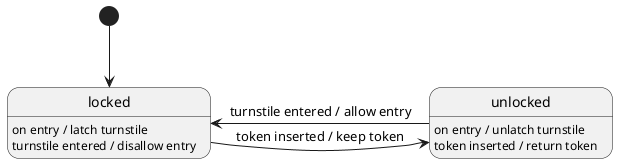

# Turnstile Example

The Turnstile example implements the following state machine:

```plantuml
@startuml
state locked
state unlocked 

[*] --> locked
locked : on entry / latch turnstile
locked : turnstile entered / disallow entry
locked -> unlocked : token inserted / keep token
unlocked : on entry / unlatch turnstile
unlocked : token inserted / return token
unlocked -> locked : turnstile entered / allow entry
@enduml
```